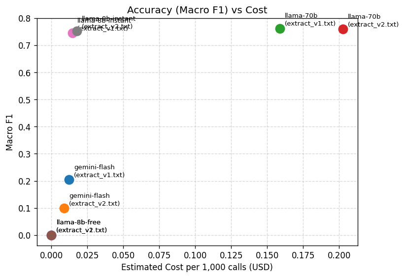
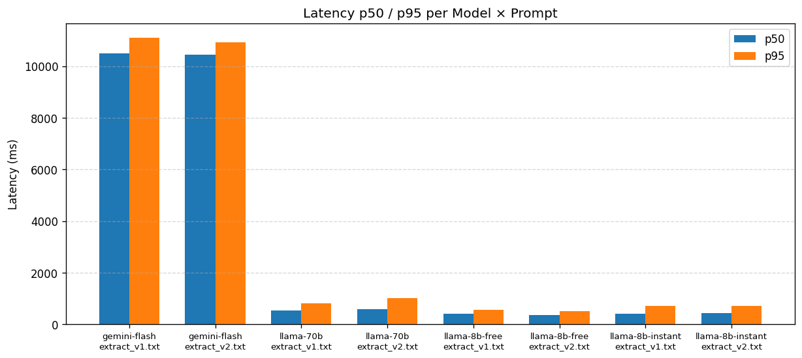
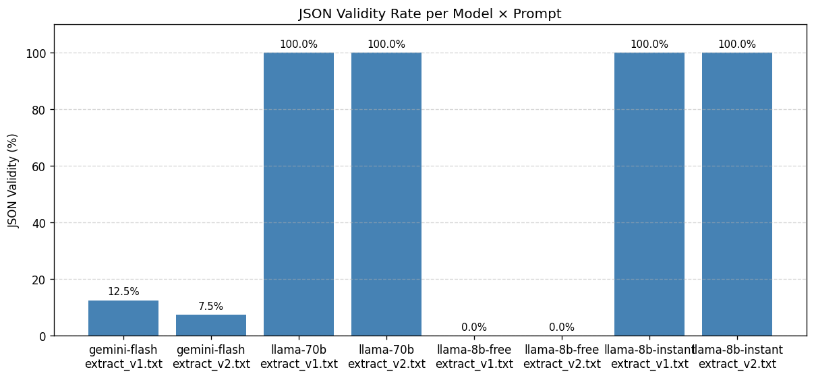
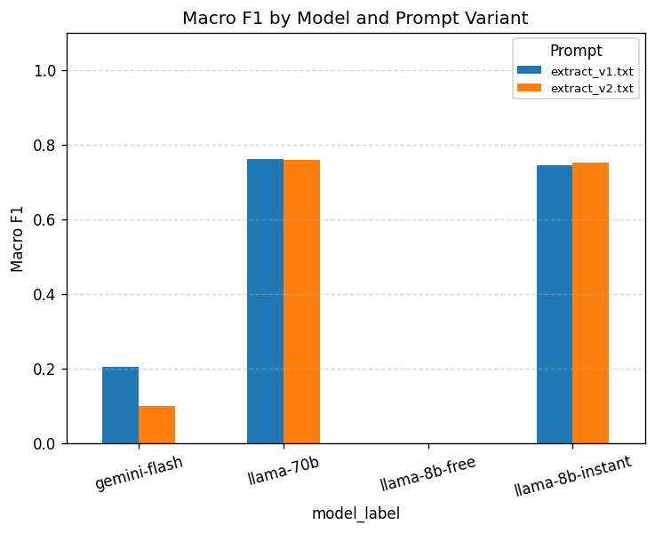

# LLM Evaluation Report

> Auto-generated by `evalharness report`. Do not edit manually — re-run `make report` to refresh.

---

## Summary Table

| model_label      | prompt_file    |   n |   macro_f1 |   json_validity |   exact_match_rate |   latency_p50_ms |   latency_p95_ms |   cost_per_1k_usd |
|:-----------------|:---------------|----:|-----------:|----------------:|-------------------:|-----------------:|-----------------:|------------------:|
| gemini-flash     | extract_v1.txt |  80 |      0.204 |           0.125 |              0.075 |          10502.8 |          11096.8 |           0.01219 |
| gemini-flash     | extract_v2.txt |  80 |      0.099 |           0.075 |              0.05  |          10448   |          10935.2 |           0.00879 |
| llama-70b        | extract_v1.txt |  80 |      0.762 |           1     |              0.65  |            532.6 |            815.3 |           0.15881 |
| llama-70b        | extract_v2.txt |  80 |      0.76  |           1     |              0.638 |            598.6 |           1029.3 |           0.20269 |
| llama-8b-free    | extract_v1.txt |  80 |      0     |           0     |              0     |            399.7 |            557.2 |           0       |
| llama-8b-free    | extract_v2.txt |  80 |      0     |           0     |              0     |            359.4 |            518.2 |           0       |
| llama-8b-instant | extract_v1.txt |  80 |      0.745 |           1     |              0.575 |            420.4 |            716.7 |           0.01445 |
| llama-8b-instant | extract_v2.txt |  80 |      0.753 |           1     |              0.612 |            428.1 |            722.8 |           0.01773 |

---

## Recommendation

**Recommended model: `llama-70b` with prompt `extract_v1.txt`**

- Macro F1: **0.762**
- Estimated cost per 1,000 calls: **$0.1588**
- Latency p50 / p95: **533 ms / 815 ms**
- JSON validity: **100.0%**

This model achieves the highest extraction accuracy among models with reliable JSON output (json_validity >= 50%). The most expensive option (`llama-70b`) costs $0.2027/1k calls with similar accuracy.

---

## Charts

### Accuracy (Macro F1) vs Estimated Cost

### Latency p50 / p95 per Model

### JSON Validity Rate

### Macro F1 by Prompt Variant

---

## Judge Reliability

The LLM judge was calibrated against 10 human-scored examples.

| Metric | Value |
|---|---|
| Mean Absolute Error (vs human) | 0.7 |
| Spearman Correlation (vs human) | 0.843 |

> A Spearman correlation > 0.7 indicates strong judge–human agreement.

---

## Metrics Explained

| Metric | Description |
|---|---|
| `macro_f1` | Average F1 across all 5 extraction fields — the primary accuracy signal |
| `json_validity` | Fraction of responses that parsed as valid JSON matching the schema |
| `exact_match_rate` | Fraction of records where every field matched the gold label exactly |
| `latency_p50_ms` | Median response time in milliseconds |
| `latency_p95_ms` | 95th-percentile response time — reflects tail latency |
| `cost_per_1k_usd` | Estimated USD cost for 1,000 calls using published pay-as-you-go pricing |

---

## Cost Note

All development runs used **free API tiers** (Google AI Studio, Groq, OpenRouter).
Cost figures above use published pay-as-you-go pricing for comparison only — actual dev cost was ₹0.
